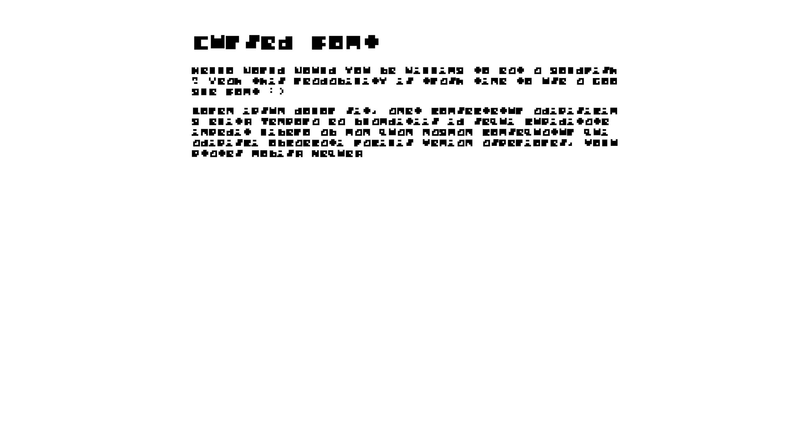

# Cursed Font

Cursed font is an amazing way to curse your users by blessing them with unreadable font. Because cursed font uses images rather than actual font files, you are able to leverage some amazing benefits that shit on accessibility.

-   users are **physically unable** to copy text unless they disable JavaScript
-   users will **become blind** after squinting too much to read an 8 bit font
-   **limited** support for characters - anything not supported is replaced with an A for internal screaming
-   **auto scales** to desired font size specified in styles
-   for some reason, all characters are **slightly offcentered**!

## Installation

on Node.js

```
>>> npm install cursed-font
```

on the Web

```js
import Font from "https://esm.sh/cursed-font";
```

## Usage

Import the `cursed-font` library and call the `main` method to initialize.

```js
import Font from "cursed-font";
font.main();
```

By default, cursed font will modify all elements containing the class `.cursed-font`. You can specify a different selector in `font.main`.

## Screenshots


